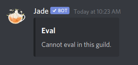
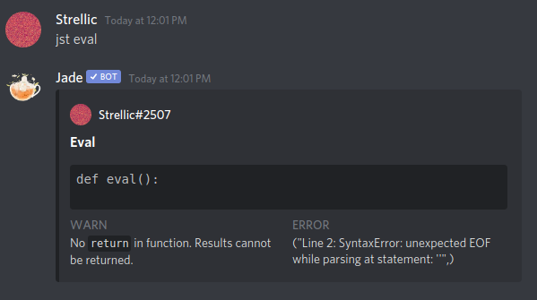
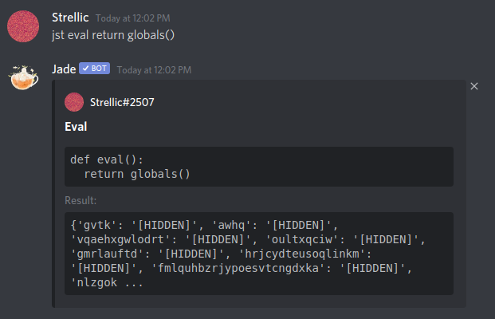
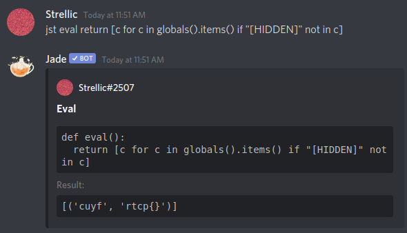
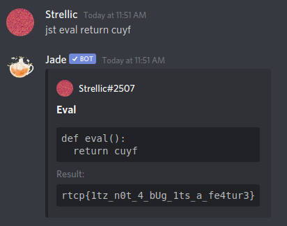

# Houseplant CTF – Adventure-Revisited

* **Category:** Pwn
* **Points:** 1872 Points

## Challenge

> Let's go on an adventure!
> The solution is in there... somewhere.
> 
> (#adventure-revisited on discord)
> 
> Creator: Jess

(hint.7z was attached - it was actually a base64 encoded image)

## Solution

Adventure-Revisited was a pwn challenge in this CTF, but I thought it was more of a misc challenge.

You're directed to #adventure-revisited on the CTF discord, and going there shows me a Discord bot. To solve the challenge, you need to pwn the bot to give you a flag.

Checking the chat, some people ran the command `jst eval` on the bot, but it errored out and said that you could not eval in this guild.



So, I invited the bot onto a private test Discord server, and tried out `jst eval` again.



`jst eval` runs Python code! I immediately tried to get some sort of a shell, but unfortunately, import, exec, eval, and even the double-underscore tricks are not allowed. Next, I hoped to try and see if the flag was stored in a global variable, so I ran `jst eval return globals()`, which returned this.



The return value has a limited size, so the massive amount of random garbage in `globals()` hides any important data. However, using some Python list comprehension, we can filter all of the `[HIDDEN]`s out.



This just leaves us with one value, `cuyf`, which has a blank flag. Huh. After like 30 more minutes of debugging and trying random things, I eventually did `jst eval return cuyf` and got the flag.



```
rtcp{1tz_n0t_4_bUg_1ts_a_fe4tur3}
```