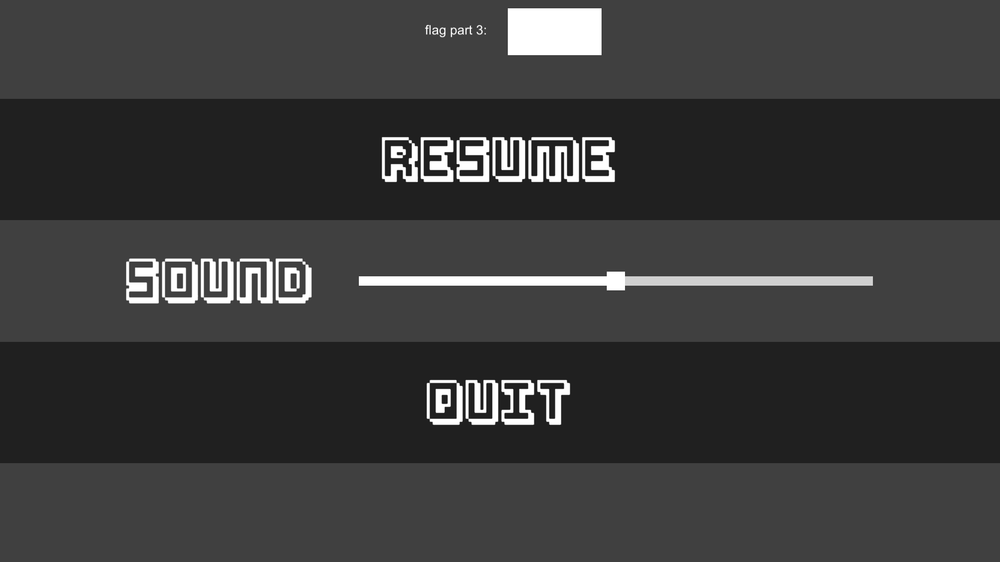
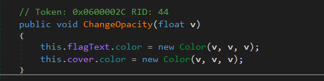
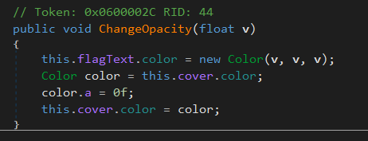
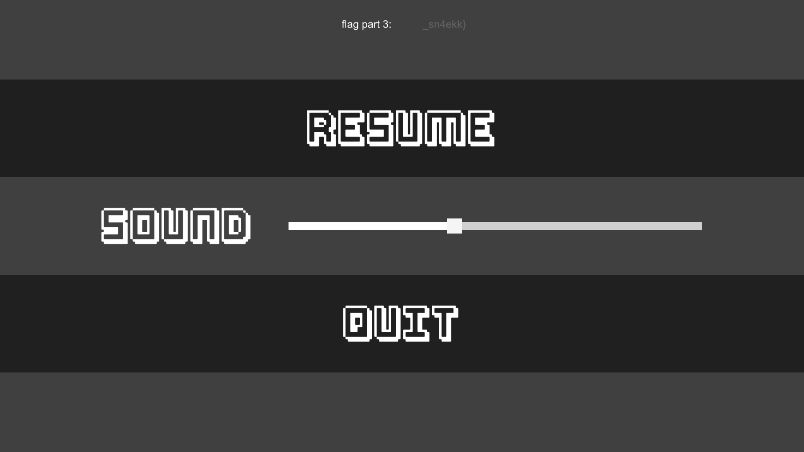
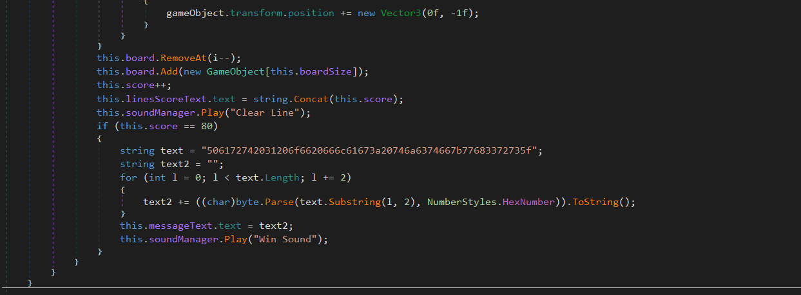
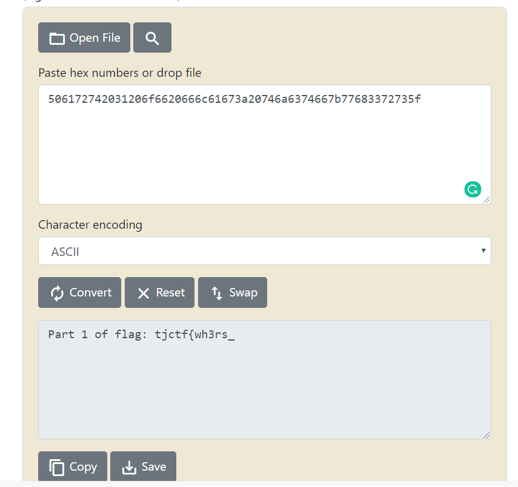
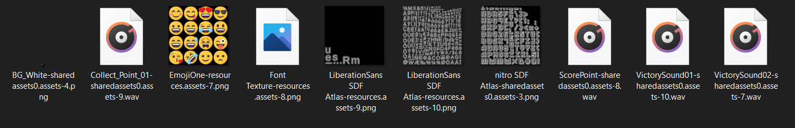

### Gamer F

Gamer F was a Unity game that combined both Snake and Tetris, and had the flag stored in three parts. Since it was a Unity game, I first played around with it. The flag for this challenge was split into three parts.

There was an obvious flag on the menu screen, but it seemed to be covered by a colored box.


Playing with the Sound bar changed the color of the box, but the flag was always hidden. So, I fired up dnSpy and opened up `Assembly-CSharp.dll`.

I quickly found this piece of code:


Changing the color with the Sound bar seems to change the color of this `cover` box. So, I made an edit to this line and made the box transparent.



After, opening the game and moving the Sound bar showed me this!



1/3 of the flag found.

Looking through the source code some more I found:


which seemed to be something related to winning or clearing the game. I converted this from hex to ASCII and got the 2nd part of the flag!


Now, for the final part of the flag, I didn't find it anywhere in the code. So, I started looking through the game's files. I fired up UnityAssetsBundleExtractor and looked through the files.



I eventually found these three audio files. One of them just played a sound effect. The next one, however, played what seemed to be the flag, but it read out the flag in Japanese. My heart sank, but thankfully the last audio file read out the last part of the flag in English. :)


```tjctf{wh3rs_the_T5sp1n_sn4ekk}```