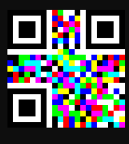
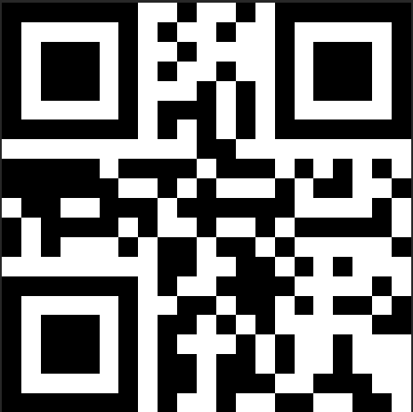
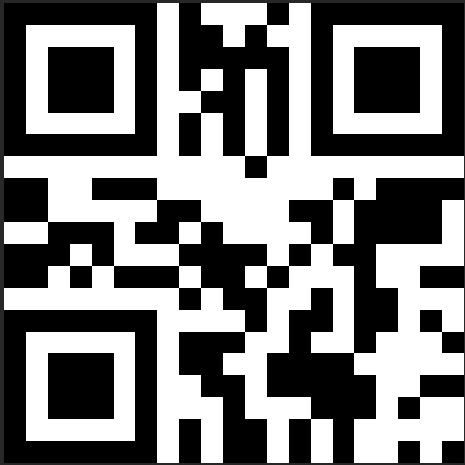
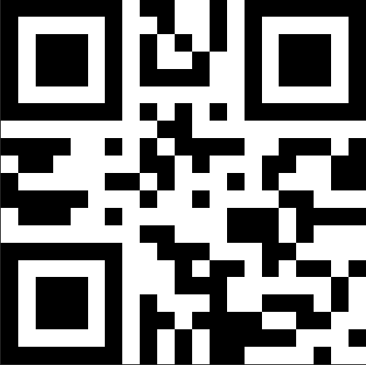

# Prism

* **Category:** Misc
* **Points:** 223

## Challenge

> We don't have the chall text but something about if only you had a prism



## Solution

At first look, since it's a photo we looked through metadata and steganography but came up with nothing. The name of the challenge got me thinking about separating the red, green, and blue. Another thing I took note of was a odd string when scanning the QR code. Thus, I separated the three colors using photoshop and got three different QR codes. The flag is retrieved by concatenating the three outputs.
Red only:


Green only:


Blue only:



```
InnoCTF{gZmLFgpflkF5hbwBlA0hmyPUkPPcugKhY}
```
